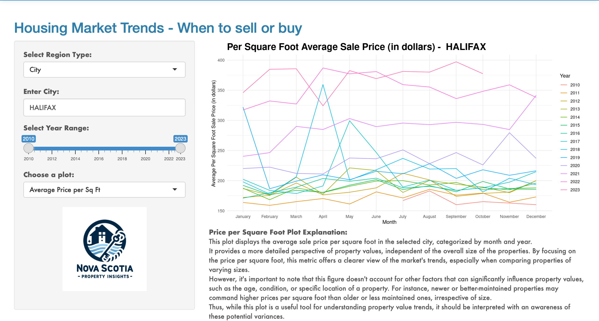

<!-- Add a container for the entire page content -->

  <!-- Sidebar content -->
  

  
    

    <strong>Yi Xie</strong> 
  

  

    <strong>Email:</strong>  <a href="mailto:yi.xie2000@gmail.com" style="color: #2171B5; text-decoration: none;">yi.xie2000@gmail.com</a> 
    <strong>GitHub:</strong>  <a href="https://github.com/yi-xie2000" target="_blank" style="color: #2171B5; text-decoration: none;">yi-xie2000.github</a> 
    <strong>Location:</strong>  Halifax, Canada</a> 
  

  

  
  <!-- Main content -->
  

  <h2 style="font-size: 20px; color: #2171B5; font-weight: bold; margin-bottom: 10px; border-bottom: 1px solid #F0F0F0; padding-bottom: 5px;">
    Overview: Nova Scotia Property Insights Platform
</h2>

I am excited to present the project I'm currently working on: the <a href=" https://jzmtko-yigit-aydede.shinyapps.io/NPI_v1/" target="_blank" style="color: #2171B5; text-decoration: underline;">Nova Scotia Property Insights Platform</a>. This user-friendly and complimentary Shiny App provides a comprehensive overview of property transactions, trends, and market dynamics across Nova Scotia, offering valuable insights into the real estate landscape.

  <ul style="font-size: 18px; color: #737373;">
  
<li><strong>Secure and Detailed:</strong>
    The platform securely handles extensive data, providing granular insights into neighborhoods, property values, and demographics.

<li><strong>Accessible to All:</strong> 
    Designed for everyone from home-buyers to researchers, it simplifies understanding the real estate market in Nova Scotia.

<li><strong>Expert-Driven Development:</strong> 
    As part of the Saint Mary's University team, we've combined analytics and academic knowledge to create this innovative tool.

<li><strong>Explore with Ease:</strong> 
    Dive into Nova Scotia's property market with this platform, your go-to resource for clear and detailed real estate insights.
  </ul>
  
  <h2 style="font-size: 20px; color: #2171B5; font-weight: bold; margin-bottom: 10px; border-bottom: 1px solid #F0F0F0; padding-bottom: 5px;">
    Behind the Scenes: My Role in the Platform
</h2>

As the principal research assistant and data engineer on the team, I am actively contributing in the following areas: 

  <ul style="font-size: 18px; color: #737373;">
<li><strong>Data Cleaning and Merging</strong> 
I leverage my proficiency in R and Python to adeptly merge complex administrative files. These files are rich with intricate details on property sales and characteristics, forming the backbone of our data analysis.

<li><strong>Data Visualization and Integration</strong> 
I have crafted specialized functions for data visualization, transforming raw data into clear, understandable formats. My expertise extends to using SQL for efficient data selection and merging, ensuring seamless integration and analysis.

<li><strong>Ongoing Contributions</strong> 
Currently, I'm focused on integrating the 2021 Canadian Census population data, a significant step in enhancing our platform's depth. Additionally, I'm spearheading the implementation of APIs for real-time data updates. These initiatives are crucial in evolving the Nova Scotia Property Insights Platform, keeping it relevant and insightful.
</ul>

 <h2 style="font-size: 20px; color: #2171B5; font-weight: bold; margin-bottom: 10px; border-bottom: 1px solid #F0F0F0; padding-bottom: 5px;">
    Inside Look: The Design of the Platform
</h2>

  <ul style="font-size: 18px; color: #737373;">
  
<li><strong>Home Page</strong> 

<li><strong>Property Look-Up Page</strong> 

<li><strong>Sales Plots Page</strong> 

<li><strong>Sales List Page</strong> 

<li><strong>Sales Map Page</strong> 

<li><strong>About Page</strong> 

</ul>
  

